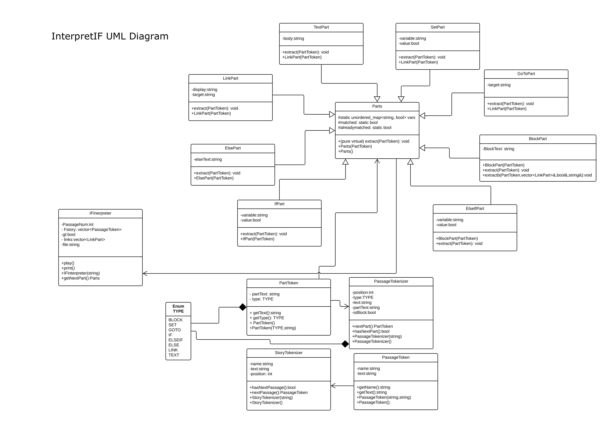

# InterpretIF

Interactive fiction is a type of story where the user determines certain actions that happen, and in turn affect how the story plays out. This project takes in a HTML file that includes all of the potential paths of a specific story and tokenizes the different parts of the story, so it is able to interactively display the required passages according to user decisions in a terminal.

`Escape.txt` is a sample Input file that contains a sample story and all the different paths of an interactive fiction story. https://twinery.org/ is a website where interactive fiction stories can be made.

The Parts classes and the IFInterpreter class work together for this project.

The Parts classes feature inheritance for the various parts of a passage:

TextPart contains a string data member that stores all the plain text between the other Part objects

A link, or LinkPart, which is visible to the user around [[these]] brackets.

If/else-if/else also have corresponding parts, which compare values of variables in the story with stored values and their functionality is the same as in regular programming.

Finally, a block or BlockPart groups the instructions that occur after each if/else-if/else statement.

A sample story file in HTML provided is titled escape.txt

# UML Diagram
Below is the UML Diagram outlining the class design of this project:

